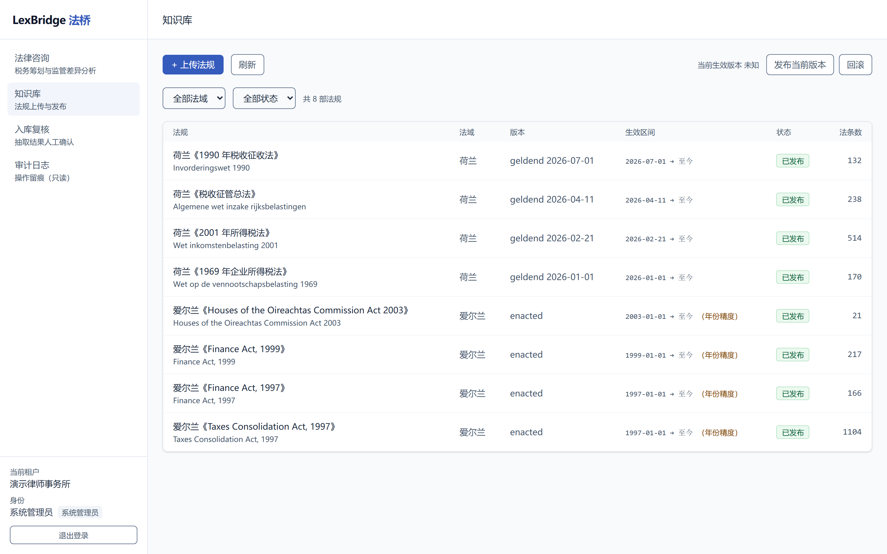
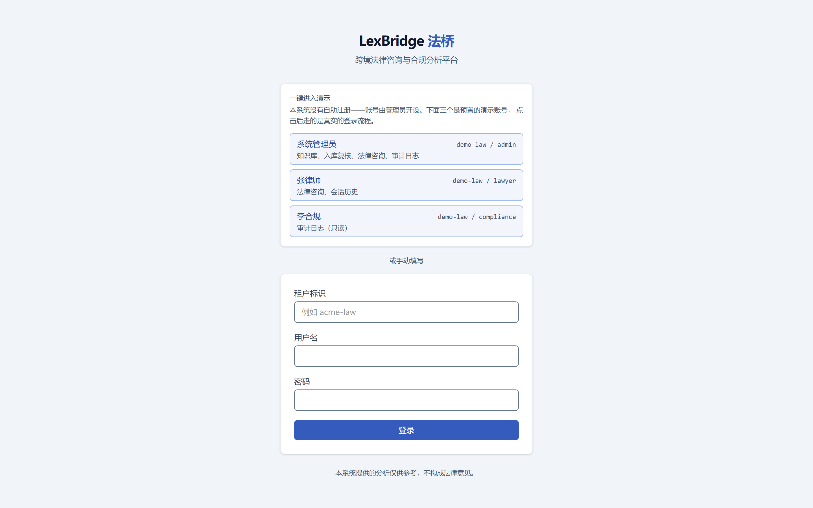
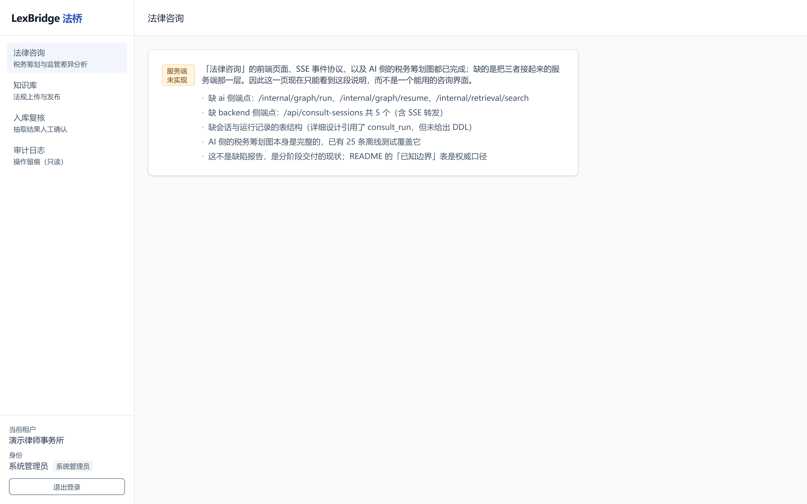

# LexBridge 法桥

面向企业律师的 AI 原生跨境法律咨询平台，以及配套的 Agent 工程化体系。

**clone 下来一条命令，就能登录、浏览 2,562 条真实法条、查到自己的审计留痕。不需要任何密钥。**

> ### 状态
>
> **已经能用的**：认证与多租户隔离、知识库（2,562 条真实法条，覆盖 IE / NL 两个法域，
> 每条可溯源到公开来源 URL）、审计留痕与 traceId 反查、角色权限（服务端强制）。
> 实测 20 项验收全过——`python scripts/verify_demo.py` 可以自己跑一遍。
>
> **还没做的**：「法律咨询」与「知识入库」两条链路的**服务端**。
> 这两块的前端页面、SSE 事件协议、以及 AI 侧的税务筹划图都已完成并有测试，
> 缺的是把它们接起来的中间层。对应页面会显示一段明确的说明，而不是一个能用的界面。
>
> 这么写不是自我贬低，是因为**「打开是能用的界面」和「打开是一段说明」必须与代码一致**——
> 否则截图与 README 就成了最不可信的那部分。完整边界见「已知边界」，逐条可复核。



<sub>知识库页面实录：真实语料，爱尔兰法规上的 `（年份精度）` 是如实标注而非渲染效果。</sub>

---

## 这个项目解决什么问题

企业律师在处理跨境业务时，面对的是**规则碎片化**：同一笔交易在中国内地、香港、
新加坡、爱尔兰、荷兰、开曼群岛可能适用完全不同的税法与监管要求，而这些规则还在持续变动。

平台要做的两件事：

1. **管理员上传各国法律文本**，系统自动解析、切分、抽取本体、生成结构化 wiki 词条并建立索引，
   复核发布后**实时生效**（无需重建索引）。
2. **律师通过两类咨询获得分析**：跨境税务筹划方案设计；利用各国法律差异的结构分析。

### 合规边界是功能需求，不是免责声明

这个领域有一条必须划清的界线：

| 区间 | 例子 | 系统行为 |
| --- | --- | --- |
| **合法区间** | 税务筹划、监管套利、选择更优的控股架构 | 正常分析与方案设计 |
| **违法区间** | 逃税、虚假申报、隐瞒、洗钱、规避制裁、无实质的空壳安排 | **明确拒答**，并给出合法替代路径 |

这不是靠提示词里写一句"不要回答违法问题"来实现的。红线判定引擎
**不允许依赖模型生成**——这条约束被固化成了代码结构：

```
DR-4  redline 不得 import chains
```

理由是：如果红线判定依赖模型，就存在"模型被说服后绕过红线"的风险。
把这条规则写进 `import-linter` 契约，让 CI 来守，比写在文档里靠人自觉可靠得多。

---

## 架构一览

技术栈由需求固定：TypeScript + Vite + Tailwind CSS / Vue3 / Spring Boot 3.3.5 / Java 21 /
LangSmith / LangChain / LangGraph / DeepAgent / LlamaIndex / LLM wiki / ontology /
硅基流动 / Redis / PostgreSQL / Docker。

其中存在一个必须说明的张力：**Spring Boot 是 JVM 生态，而 LangChain、LangGraph、
DeepAgent、LlamaIndex 都是 Python 原生库**，无法共处一个进程。在"不新增未列出的技术"
的约束下，唯一自洽的读法是双运行时：

```
浏览器 ──▶ web (nginx) ──▶ api (Spring Boot / Java 21) ──▶ ai (Python)
                              │                              │
                              └──────▶ postgres / redis ◀────┘
```

- `api` 承担业务主干：租户、权限、审计、会话、发布
- `ai` 承担 AI 链路：解析、抽取、检索、编排
- `ai` **不发布宿主端口**，只在内部网络可达

完整设计见 [docs/architecture-4plus1.md](docs/architecture-4plus1.md)（华为 4+1 视图）。

---

## 快速开始

```bash
cp deploy/.env.example deploy/.env
# 生成两个密钥填入 .env（其余可留默认）
#   openssl rand -base64 48

docker compose -f deploy/docker-compose.yml -f deploy/docker-compose.override.yml up -d
```

打开 `<http://localhost:${WEB_PORT}>`。`WEB_PORT` 的取值以你本机的 `deploy/.env` 为准
（`.env.example` 默认是 **80**；仓库根目录那份本机 `.env` 曾设为 8088 以避开端口占用）。
**不要照抄某个固定端口**——照抄会打开一个没有服务的地址。

首次启动约 2 分钟。启动顺序是编排好的：
`postgres → api（迁移）→ seed（灌入 2,562 条法条 + 319 条向量）→ web`。
**`web` 在灌库完成前不启动**，所以不会打开页面看到一个空的知识库。

打开登录页，**上面有三个"一键进入演示"的按钮，点一下就进去了**，不需要先去翻文档。



本系统没有自助注册——账号由管理员开设，这是产品口径（PRD 里"管理本租户成员"是租户管理员的能力），
不是待补的功能。对访客来说那意味着会停在一个填不出"租户标识"的登录页上，
所以把已经公开的演示凭据直接做成了按钮；**点击走的是真实的登录流程**，
JWT 签发、租户解析、审计留痕一个都不少。
演示模式关闭时（`DEMO_DATA=false`）这一块整个不渲染，生产部署上不会出现任何入口。

也可以按 `demo-law` / `admin` / `LexBridge@2026` 手动填写。三个角色的完整清单见
[使用手册](docs/使用手册.md#3-演示账号)。

> **`seed` 容器显示 `Exited (0)` 是正常的**——它是一次性灌库任务，干完就退出。
> 六个容器里五个常驻，它是第六个。`Exited (1)` 才是失败，原因写在
> `docker compose logs seed` 里。

> **默认 `MODEL_MODE=replay`**：回放录制好的真实响应，使演示确定、可离线、零成本。
>
> ⚠️ **但 `ai-service/fixtures/replay/` 目前是空的**（只有 `.gitkeep`），
> 所以 replay 模式**现在跑不通**。这是一个**未完成的交付项**，不是设计缺陷：
> 在录制第一批 fixture 之前，请用 `MODEL_MODE=real` 并填入 `SILICONFLOW_API_KEY`。
>
> 注意这与上面的"零密钥"并不矛盾：**知识库那条链路不经过任何模型调用**——
> 语料与预计算向量都随仓库提交，所以它能离线跑通。
> 而咨询链路一旦落地就会经过模型，那时 replay fixture 是必需品。见「已知边界」。
>
> 另外，密钥一律只放进被 `.gitignore` 覆盖的 `deploy/.env`，不要写进任何受版本控制的文件。

本地开发（需 JDK 21；Maven 由 wrapper 提供）：

> **`JAVA_HOME` 必须指向 JDK 21，而不是 JDK 17。** 只装了 17 时 `mvnw` 会以
> "release version 21 not supported" 之类的形式失败，看起来像代码问题。若机器上两个版本共存
> （Windows 下常见于 `C:\Program Files\Microsoft\jdk-21.*`），可在命令里临时覆盖而不改系统配置：
>
> ```powershell
> $env:JAVA_HOME="C:\Program Files\Microsoft\jdk-21.0.12.101-hotspot"
> .\mvnw.cmd -B verify
> ```

```bash
cd ai-service   && uv sync --extra dev && uv run pytest
cd backend      && ./mvnw verify
cd frontend     && npm ci && npm run dev
```

---

## clone 之后你能玩什么

不想先读文档的话，这张表就是结论。详细步骤见[使用手册](docs/使用手册.md)。

| 你能做的事 | 怎么进去 |
| --- | --- |
| 登录（不用注册、不用读文档） | 登录页点「一键进入演示」，三个角色各一个按钮 |
| 看到多租户与角色差异 | 换一个按钮再点一次；或手动填 `demo-law` / `admin` / `LexBridge@2026` |
| 浏览 8 部真实法规、2,562 条法条，按法域与状态筛选 | 侧栏「知识库」 |
| 点开任一条，看生效区间、日期精度与**公开来源 URL** | 知识库列表点任意一行 |
| 查审计留痕，点 traceId 反查"这一次发生了什么" | 侧栏「审计日志」 |
| 看两个租户的数据确实互不可见 | 隐私窗口再登 `acme-law`，对比审计日志 |
| 看角色权限**在服务端**被强制（不只是菜单不显示） | 用 `lawyer` 登录，它读不到审计 |
| 一条命令把上面这些全验一遍 | `python scripts/verify_demo.py` |

**现在还不能做的**（点进去会看到一段说明，而不是能用的界面）：
法律咨询、会话历史、知识入库（上传 / 复核 / 发布 / 回滚）。
这四处的服务端尚未实现——前端页面与 AI 侧编排都已完成，缺的是中间层。



<sub>未实现的页面长这样：说明缺哪几个端点，而不是一个红色报错。</sub>

---

## 目录结构

```
├─ docs/            PRD、4+1 视图、决策记录、详细设计、使用手册
├─ frontend/        Vue3 + Vite + TypeScript + Tailwind CSS
├─ backend/         Spring Boot 3.3.5 / Java 21（业务主干）
├─ ai-service/      Python（LangChain / LangGraph / DeepAgent / LlamaIndex）
├─ deploy/          Docker Compose 编排、初始化脚本、种子数据
├─ scripts/         冒烟与校验脚本
└─ .github/         CI
```

---

## 值得看的几个设计决策

### 三模式模型工厂：`real` / `replay` / `mock`

所有模型调用都经 `ai-service/app/chains/model_factory.py`，任何地方都不直接
`ChatOpenAI(...)`。这不是为了抽象而抽象，而是同时解决三个约束：

- CI 不能花钱，也不能把 API Key 放进公开仓库的 Secrets
- 演示不能因网络抖动或模型产品线变动而翻车
- **面试官 clone 下来应当无需密钥即可跑通**

`replay` 模式把真实响应（含 `tool_calls` 结构、embedding 向量、rerank 分数）
录成 fixture 提交进仓库，之后无限次离线重放。

### 架构规则由构建强制，不由文档约束

| 编号 | 规则 | 强制手段 |
| --- | --- | --- |
| DR-1 | `domain` 不得依赖 `infrastructure` / `application` / `interfaces` | ArchUnit |
| DR-2 | `interfaces` 不得直接依赖 `domain.repository` | ArchUnit |
| DR-3 | `graph` 不得直接操作数据库 | import-linter |
| **DR-4** | **`redline` 不得 import `chains`** | **import-linter** |
| DR-6 | 前端 `api` 层是唯一发起网络请求处 | ESLint |

### 多租户隔离是五层管道，不是一次判断

JWT → 应用层 → 数据库 RLS → 检索层强制过滤注入 → 审计。
其中两处最容易失守：

- **PostgreSQL 的 RLS 默认对表 owner 不生效。** 若应用角色同时是表的 owner，
  RLS 形同虚设，隔离会**静默失效**。因此应用角色刻意不是 owner，
  迁移里还会显式 `FORCE ROW LEVEL SECURITY`。
- **LangGraph 的检查点表主键只有 `thread_id`。** 猜中就能 `Command(resume=...)`
  别人的会话。因此约定 `thread_id = "{tenant_id}:{run_id}"`，并在恢复路径上校验前缀。

### 所有决策都有实测依据

`docs/decision-record.md` 记录的是「实测证明什么可行」，与设计文档里「打算怎么做」
分开存放。内容包括 embedding 的真实批量上限、并发是否被串行化、
模型的结构化输出能力到底如何——其中若干条推翻了官方文档或第三方调研的说法。

---

## 已知边界

诚实标注未达标项，比含糊过去更有用。

| 项 | 目标 | 当前 | 说明 |
| --- | --- | --- | --- |
| AC-1.6 语料规模 | 六法域 ≥ 5,000 条 | **2 法域、2,562 条** | IE 1,508 + NL 1,054，全部真实、逐条标注来源 URL。**未达 5,000 条与 6 法域**：CN/HK/SG/KY 的公开站点用普通 HTTP 拿不到正文（CN 正文存内网 OBS、SG 被 AWS WAF 拦、HK/KY 是 JS 前端外壳），逐条证据见 [deploy/seed/corpus/SOURCES.md](deploy/seed/corpus/SOURCES.md)。按决策 D-02 如实记录，不虚报、不改指标 |
| 生效日期精度 | 全部精确到日 | IE 为**年**精度 | 爱尔兰站点不提供机器可读的通过日期，记录带 `date_precision=YEAR`，引用中会显式标注精度，而非假装知道具体日期 |
| 演示账号 | 三个角色账号开箱可用 | ✅ 已达成 | 两个租户各三个账号，由 `deploy/.env` 的 `DEMO_DATA`（默认 `true`）控制。**生产部署必须设为 `false`**——`DemoDataBootstrap` 建的是固定口令账号。代码侧还有 `@ConditionalOnProperty` 兜底，两层重复是有意的 |
| 咨询链路服务端 | 两类咨询端到端可用 | **未实现** | 前端页面、SSE 事件协议、`consult_tax_graph` 与 `diverge` 的矩阵库都已就绪（AI 侧有 25 条离线测试覆盖），**缺中间层**：`ai` 的 `/internal/graph/run`、`/resume`、`/internal/retrieval/search`，`backend` 的 `/api/consult-sessions` 共 5 个端点，以及会话/运行记录的表（详细设计引用了 `consult_run` 但未给出 DDL）。对应页面显示明确说明而非报错 |
| 知识入库服务端 | 上传 → 解析 → 抽取 → 复核 → 发布 | **未实现** | 表结构已建好（`kb.ingestion_job`、`kb.review_task`、`app.publish_record`、`app.review_decision`），`api` 侧的 `IngestionGateway` 与 `AiServiceClient` 也已实现；`ai` 侧的 `/internal/index/document` 只到"建任务"（`status=RECEIVED`），解析之后各步未实现。因此 `/api/knowledge/*` 共 7 个端点不存在 |
| 预计算向量覆盖 | 全量 2,562 条 | **319 条（12.5%）** | 全量向量约 13MB 会让 clone 明显变慢，故只随仓库提交 3 部完整法规（319 条）。**未覆盖的法条不是错误状态**：照常展示、照常关键词检索，只是语义检索无覆盖。覆盖清单与重生成方式见 [deploy/seed/vectors/README.md](deploy/seed/vectors/README.md) |
| replay fixture | 提交后零密钥跑通咨询 | **目录为空** | `ai-service/fixtures/replay/` 只有 `.gitkeep`。且当前**没有录制工具**——`MODEL_MODE=real` 并不会录制，`record_*` 只被测试调用。在补上 recorder 之前，"真实调用一次、离线无限重放"这条路径无法执行。这不影响知识库链路（它不经过模型） |
| 扫描件 PDF | — | 不支持 | LlamaIndex core 不含 OCR；扫描件进入"待人工干预"队列并给出原因（AC-1.7） |
| 评测流水线 | 完整 golden 集 + CI 定时门禁 | 最小评测集 | 足以产出核心指标的实测数字，不做定时评估 |
| DeepAgent 长报告 | — | 可选路径 | 实测该模型不主动使用规划工具，若启用需显式提示；不可用时退化为普通 LangGraph fan-out |
| 多语言界面 | — | 仅中文 | 语料支持多语言，界面未做 i18n |

---

## 文档

| 文档 | 内容 |
| --- | --- |
| [PRD](docs/PRD.md) | 目标与非目标、用户故事、方案概述、验收标准、风险 |
| [4+1 视图](docs/architecture-4plus1.md) | 场景 / 逻辑 / 开发 / 进程 / 物理五视图与追溯矩阵 |
| [决策记录](docs/decision-record.md) | **实测确证的决策与踩过的坑** |
| [详细设计](docs/detailed-design.md) | 字段级 DDL、算法、重点流程 |
| [使用手册](docs/使用手册.md) | **拿到仓库的人先读这份**：启动、演示账号、分角色操作、常见问题、诚实的能/不能清单 |
| [截图](docs/images/) | 由 `npm run screenshots` 从运行中的实例实拍，可重跑 |

---

## 许可

代码以 [MIT](LICENSE) 授权。**语料数据不在 MIT 覆盖范围内**——
`deploy/seed/corpus/` 下的法规文本采集自爱尔兰与荷兰的政府公开站点，
逐条记录了来源 URL（见 [SOURCES.md](deploy/seed/corpus/SOURCES.md)），
著作权状态取决于来源站点所在法域的规定，本项目不主张。复用前请自行核对来源站点的条款。

---

## 免责声明

本系统提供的分析仅供参考，不构成法律意见。使用者应就具体事项咨询具备相应法域
执业资格的律师。
