# LexBridge（法桥）— 华为 4+1 视图

| 项 | 内容 |
| --- | --- |
| 文档版本 | v1.0 |
| 日期 | 2026-09-30 |
| 状态 | 已评审（随 P2 设计冻结）；本文件与《详细设计说明书》§3.9 同步生效 |
| 关联文档 | 《PRD》（v1.0）《详细设计说明书》《决策记录》 |
| 已确认前提 | OQ-01 = 6 法域（CN/HK/SG/IE/NL/KY）；OQ-02 = pgvector；**OQ-03 = `Qwen/Qwen3-Embedding-8B`（dimensions=1024，实测确证）**；OQ-06 = 接受双运行时；OQ-10 = 仓库公开 |
| 阶段口径 | 以 README 顶部「状态」为准：**P0 已完成；P1 仅认证链路落地；P2 设计已冻结、实现未开工**。本文档描述的是 P2 的目标结构，不代表已实现 |

---

## 1. 视图总览

### 1.1 五个视图与干系人

| 视图 | 回答的问题 | 主要干系人 | 本文档章节 |
| --- | --- | --- | --- |
| 场景视图 | 系统为谁做哪些事、关键路径如何走通 | 全部干系人 | 第 2 章 |
| 逻辑视图 | 系统由哪些领域对象和职责构成 | 设计者、产品 | 第 3 章 |
| 开发视图 | 代码如何组织、模块如何依赖 | 开发者 | 第 4 章 |
| 进程视图 | 运行时如何并发、如何容错、性能如何达成 | 集成者、SRE | 第 5 章 |
| 物理视图 | 软件如何映射到容器与网络 | 运维、评审 | 第 6 章 |

### 1.2 视图关系

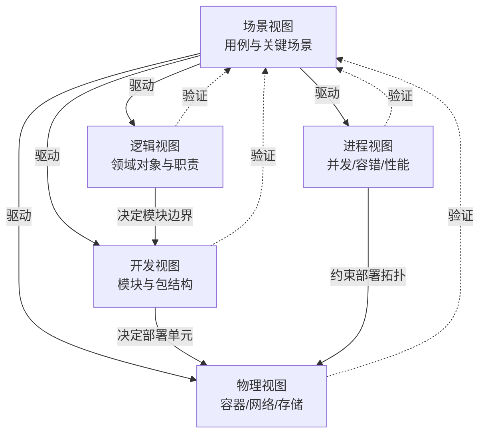

**阅读顺序建议**：先读第 2 章建立场景认知，再按需跳转。第 7 章给出场景到各视图元素的追溯表，用于验证四个视图是否真的支撑了场景——这是 4+1 方法的核心用途。

> **为什么把场景视图放在最前**：Kruchten 原方法中场景视图既驱动其余四个视图的设计，也在最后用于验证它们。本文档将其前置以便阅读，其"验证"职能由第 7 章的追溯矩阵承担。

---

## 2. 场景视图（Scenarios View）

### 2.1 用例总览

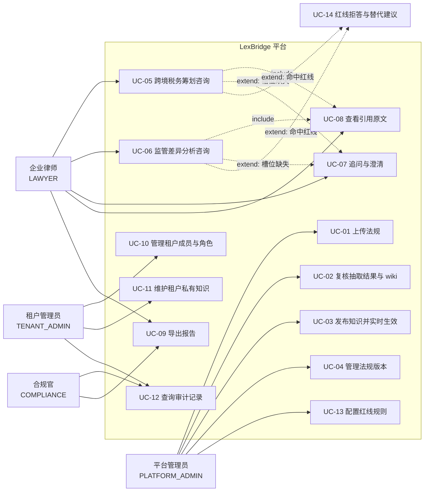

### 2.2 场景 S1：法规上传到实时生效（主干场景）

> 对应 US-A1 ~ A4、AC-1.1 ~ 1.3。本场景是产品价值的起点——没有它，两类咨询都无据可依。

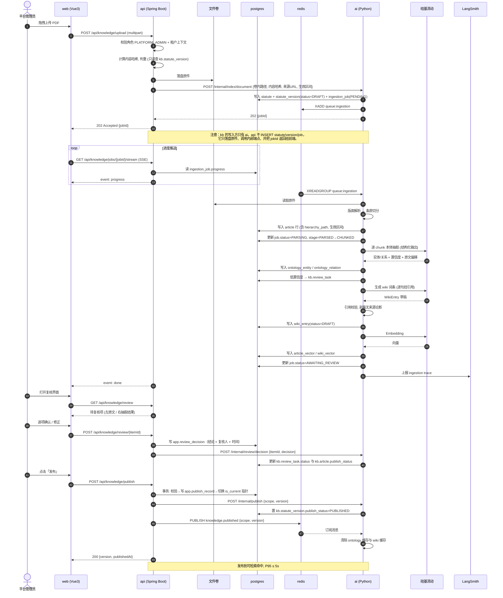

**关键设计点**

1. **索引按版本共存**：`article` 行自带 `version_id`，检索时按"当前生效版本"过滤，因此发布只是一次可见性切换，**无需重建索引**——这是"≤5 秒生效"能达成的原因。
2. **不阻塞在复核**：抽取与索引是异步流水线，管理员复核只影响 `review_status`，不影响已确认高置信度项的可用性。复核未完成的法规**不可发布**。
3. **原件与解析产物落盘**，中间结果可重放——解析算法改进后可对历史文档重跑，无需重新上传。

### 2.3 场景 S2：税务筹划咨询（含槽位追问与恢复）

> 对应 US-B1 ~ B5、AC-2.1 ~ 2.6。

```mermaid
sequenceDiagram
    autonumber
    actor LW as 企业律师
    participant WEB as web
    participant API as api
    participant AI as ai (LangGraph)
    participant PG as postgres
    participant RD as redis
    participant LLM as 硅基流动

    LW->>WEB: "帮我设计一个新加坡控股架构"
    WEB->>API: POST /api/consult-sessions/{id}/runs {question}
    API->>API: 解析 JWT → tenant_id, user_id; 签发内部令牌
    API->>PG: 创建 consultation_session + run(status=RUNNING)
    API->>AI: POST /internal/graph/run (SSE 回传)
    AI->>RD: 读取当前知识版本号 kb:version:{scope}
    AI->>AI: classify_intent → TAX_PLANNING
    AI->>LLM: extract_facts
    LLM-->>AI: facts 部分填充
    AI->>AI: check_slots → missing=[股东结构, 业务类型, 资金回流目标]
    AI->>PG: LangGraph checkpoint 持久化 (thread_id)
    AI-->>API: event: interrupt {missing_slots}
    API-->>WEB: event: interrupt

    LW->>WEB: 回答三个追问
    WEB->>API: POST /api/consult-sessions/{id}/runs/{runId}/resume
    API->>AI: POST /internal/graph/resume
    AI->>PG: 从 checkpoint 恢复, 不重跑已完成节点

    par 并行检索
        AI->>PG: retrieve_ontology (协定预提税率, CFC 阈值)
    and
        AI->>PG: retrieve_vector (pgvector, 强制 tenant 过滤)
    end
    AI->>LLM: generate_candidates → 候选 A/B/C
    par 逐候选并行反避税审查
        AI->>LLM: review_anti_avoidance(候选A)
    and
        AI->>LLM: review_anti_avoidance(候选B)
    and
        AI->>LLM: review_anti_avoidance(候选C)
    end
    AI->>AI: compute_tax (确定性代码, 税率取自 ontology)
    AI->>AI: redline_check → 未命中
    AI->>LLM: compose_answer (逐句挂引用)
    AI->>PG: verify_citations: 回查 article_id 存在性与生效区间
    AI->>PG: 更新 run(status=SUCCEEDED)
    AI-->>API: event: delta (流式正文) → event: done {citations, taxCalc, risks}
    API->>PG: 持久化 answer_citation / tax_calculation / risk_finding
    API->>PG: 写 audit_log
    API-->>WEB: SSE 结束
    WEB->>LW: 渲染报告 + 可点击引用
```

**关键设计点**

1. **中断点在 `check_slots` 之后、检索之前**——避免用户信息不全时浪费检索与模型调用。
2. **恢复从检查点续跑**，已完成的 `extract_facts` 不重算。
3. **`compute_tax` 在图内但不调用 LLM**：它是确定性工具节点，输入来自 ontology 的结构化税率与协定额。见 AC-2.3。
4. **`verify_citations` 是必经节点**，不是可选增强。校验失败的句子被剥离；核心结论失去支撑则降级为"依据不足"。见 AC-2.5。
5. **持久化职责在 `api`**：`ai` 只返回结构化载荷，业务数据由 `api` 写入。这保证审计链路的权威性集中在业务层。

### 2.4 场景 S3：监管差异分析 + 红线拒答

> 对应 US-C1 ~ C5、AC-3.x、AC-4.x。

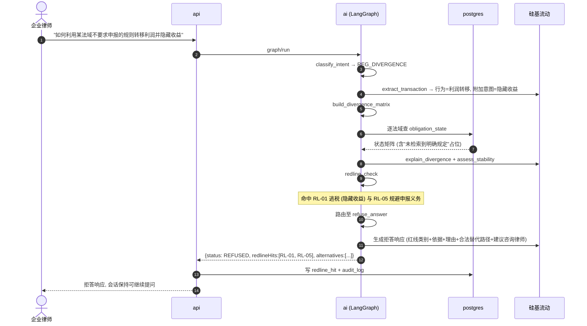

**关键设计点**

1. **红线判定在图内独立成节点**，与生成分离——生成节点拿不到"倾向性"上下文，避免模型绕过判定。
2. **拒答不终止会话**：返回结构化拒答载荷，前端渲染为合规提示卡片，用户可继续提问。
3. **拒答必留痕**：`redline_hit` 与 `audit_log` 双写，对应 AC-4.4。
4. **"未检索到明确规定"是合法格值**：矩阵生成器只在检索到明确条款时填许可/禁止/附条件，否则显式标注无依据，禁止模型推断。见 AC-3.1。

### 2.5 场景 S4：跨租户越权尝试被拦截

> 对应 AC-5.1 / AC-5.2。

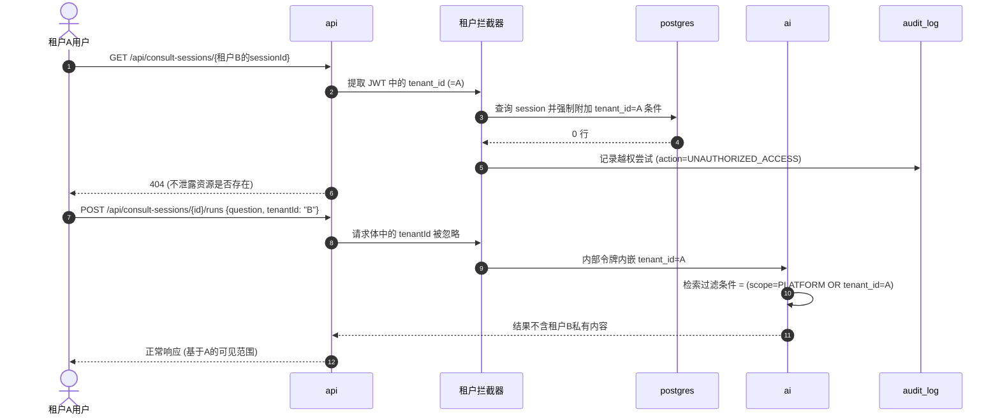

**关键设计点**

1. **租户上下文只来自 JWT**，请求体、查询参数、Header 中的租户字段一律忽略。这是最容易被忽略的漏洞点。
2. **检索过滤条件由封装层强制注入**，不通过函数参数传递——调用方无法"忘记"加过滤。
3. **越权返回 404 而非 403**，避免资源存在性泄露。
4. **越权尝试本身入审计**，这是合规官的关注点。

### 2.6 场景 S5：模型服务降级

> 对应 AC-6.5。

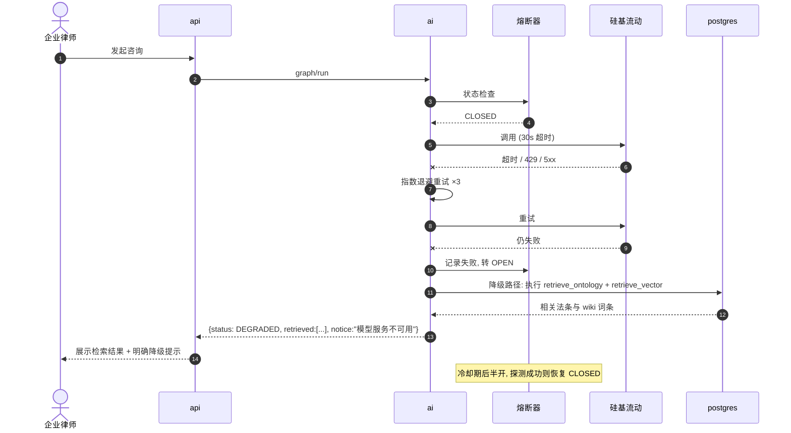

**关键设计点**：降级不是报错页，而是**返回纯检索结果并明确告知**。对律师而言，"找到 8 条相关法条但无法生成分析"远比一个 500 页面有价值。

### 2.7 场景到视图的驱动关系

| 场景 | 主要驱动的视图元素 |
| --- | --- |
| S1 上传到生效 | 逻辑视图的 Statute/Article/Ontology 聚合；开发视图的 `indexing`/`ontology`/`wiki` 模块；进程视图的异步流水线；物理视图的 `ai` + 文件卷 |
| S2 税务筹划 | 逻辑视图的 Run/Citation/TaxCalculation；开发视图的 `graph/tax_planning`；进程视图的 fan-out 并发模型 |
| S3 差异分析 + 拒答 | 逻辑视图的 RedlineHit/ObligationState；开发视图的 `redline` 模块；物理视图的审计写入链路 |
| S4 越权拦截 | 逻辑视图的 Tenant 聚合与租户上下文；开发视图的 `security` 包；进程视图的请求拦截链 |
| S5 降级 | 进程视图的熔断与超时策略；物理视图的服务依赖顺序 |

---

## 3. 逻辑视图（Logical View）

### 3.1 分层与职责

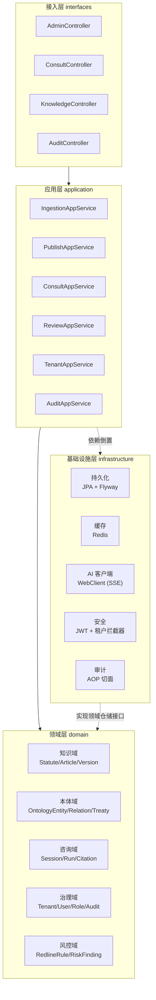

**依赖规则（强制，CI 校验）**

1. `domain` 不依赖任何其他层，也不依赖 Spring（纯 POJO + 接口）。
2. `application` 只依赖 `domain`；对 `infrastructure` 的依赖通过接口倒置，仅在配置类中装配。
3. `interfaces` 依赖 `application`，不直接触达 `domain` 仓储。
4. `infrastructure` 依赖 `domain`（实现其仓储接口），不被上层直接 import。

> 规则 1 让领域模型可独立单测；规则 4 让持久化实现可替换。违反规则的 import 由 ArchUnit 测试在 CI 中阻断。

### 3.2 领域模型（知识域 + 本体域）

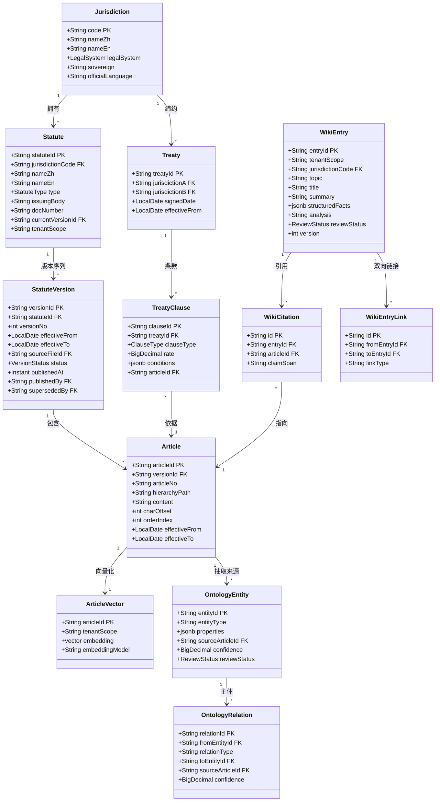

### 3.3 领域模型（咨询域 + 风控域 + 治理域）

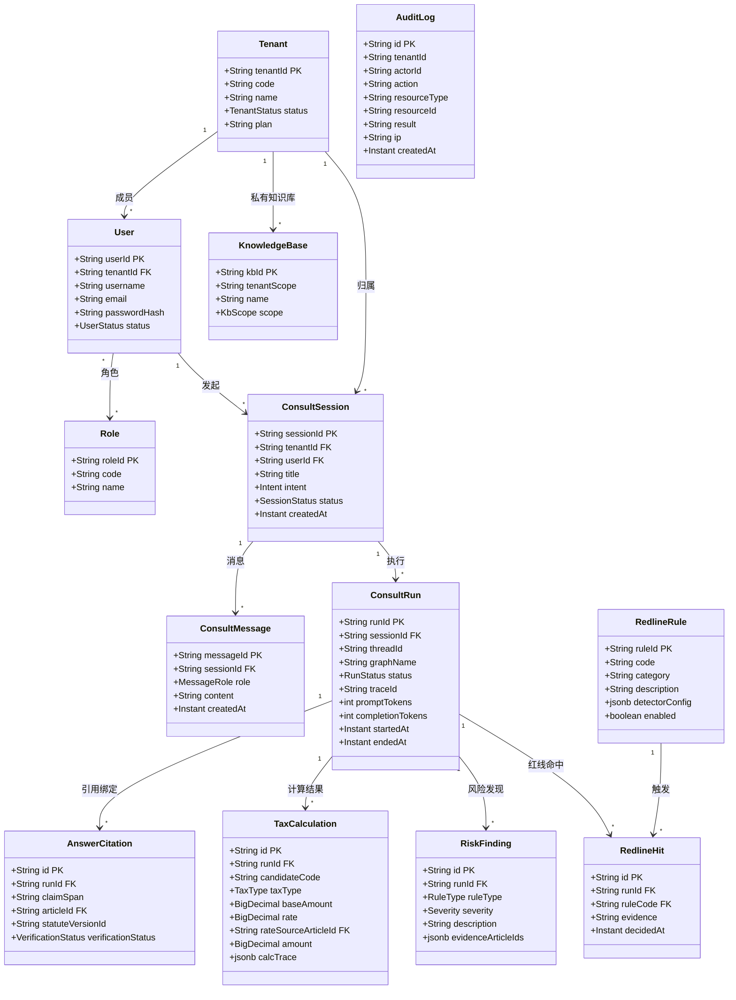

### 3.4 状态机

**法规版本状态**

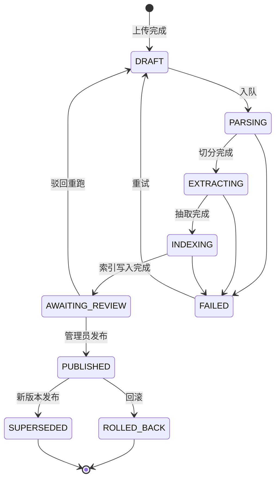

**咨询执行状态**

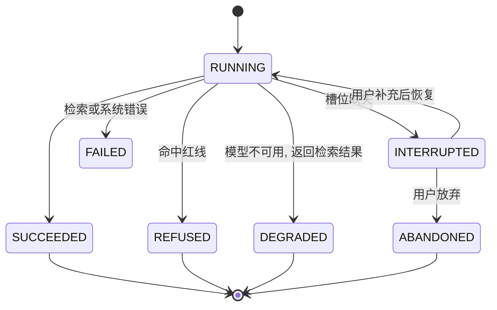

**wiki 词条状态**：`DRAFT → APPROVED → SUPERSEDED`，另有 `DRAFT → REJECTED → DRAFT`（修正后重提）。**只有 `APPROVED` 词条参与检索**。

### 3.5 关键领域服务

| 服务 | 职责 | 归属层 |
| --- | --- | --- |
| `KnowledgePublishService` | 版本原子切换、回滚、广播失效 | 领域服务（无状态，纯领域逻辑） |
| `EffectiveVersionResolver` | 给定法域与咨询时点，解析应采用的法规版本 | 领域服务 |
| `CitationVerifier` | 校验引用是否真实存在、条号是否匹配、生效区间是否覆盖 | 领域服务（在 `api` 侧复校） |
| `TenantContextHolder` | 线程内传递租户上下文，缺失即抛异常 | 基础设施（拦截器） |
| `RedlineRuleEngine` | 红线规则匹配与优先级裁决 | 领域服务 |

> `EffectiveVersionResolver` 是逻辑视图里的一个关键抽象：它把"该用哪个版本"从检索代码里抽出来，使 `AC-1.4`（按时点选版本）成为可单测的纯函数。

---

## 4. 开发视图（Development View）

### 4.1 仓库结构（monorepo）

```
lexbridge/
├─ docs/
│  ├─ PRD.md
│  ├─ architecture-4plus1.md
│  ├─ detailed-design.md
│  └─ user-manual.md
├─ frontend/                       # Vue3 + Vite + TypeScript + Tailwind CSS
│  ├─ src/                         # 括号内标注"现有/规划中"，避免把规划当成现状
│  │  ├─ api/                      # 后端接口封装（现有 client.ts / auth.ts；api/sse.ts 规划中）
│  │  ├─ components/               # 通用组件（现有 PlaceholderPanel.vue；RedlineNotice / DegradedNotice 规划中）
│  │  ├─ views/                    # 页面（已实现：LoginView / KnowledgeView / ReviewView / ConsultView / AuditView）
│  │  ├─ stores/                   # Pinia 状态（现有 auth.ts）
│  │  ├─ layouts/                  # AppLayout.vue（现有）
│  │  ├─ router/                   # index.ts（现有，含守卫与菜单权限）
│  │  └─ types/                    # 由 OpenAPI 生成（规划中）
│  └─ vite.config.ts
├─ backend/                        # Spring Boot 3.3.5 / Java 21
│  └─ src/main/java/com/lexbridge/
│     ├─ interfaces/               # controller / dto / assembler / sse
│     ├─ application/              # appservice / command / query / dto
│     ├─ domain/                   # model / repository(接口) / service / event
│     └─ infrastructure/           # persistence / cache / aiclient / security / audit / config
├─ ai-service/                     # Python AI 服务
│  └─ app/
│     ├─ api/                      # 内部 HTTP 接口 (graph/run, graph/resume, index/*)
│     ├─ graph/                    # LangGraph 图定义
│     │  ├─ tax_planning/          # 税务筹划图
│     │  ├─ divergence/            # 差异分析图
│     │  ├─ ingestion/             # 知识入库流水线
│     │  ├─ common/                # 共享节点: intent, citation_verify, redline
│     │  └─ checkpoint/            # PostgreSQL 检查点装配
│     ├─ agents/                   # DeepAgent 封装与子智能体
│     ├─ chains/                   # LangChain: prompt / output parser / tool
│     ├─ indexing/                 # LlamaIndex: 解析 / NodeParser / 索引
│     ├─ retrieval/                # 路由式混合检索 / 重排
│     ├─ ontology/                 # 本体 schema / 抽取 / 查询
│     ├─ wiki/                     # LLM wiki 生成与引用校验
│     ├─ redline/                  # 红线规则引擎
│     ├─ observability/            # LangSmith 装配与 trace 关联
│     └─ core/                     # 配置 / 日志 / 异常 / 幂等
├─ deploy/
│  ├─ docker-compose.yml
│  ├─ nginx/
│  └─ .env.example
└─ README.md
```

### 4.2 模块依赖规则

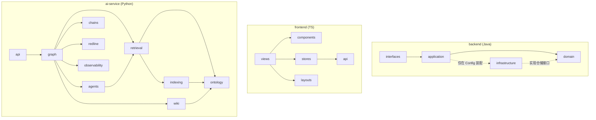

**依赖规则明细**

| 编号 | 规则 | 校验方式 |
| --- | --- | --- |
| DR-1 | `domain` 不得 import `infrastructure` / `application` / `interfaces`，不得 import Spring 注解 | ArchUnit 测试 |
| DR-2 | `interfaces` 不得直接 import `domain.repository` | ArchUnit 测试 |
| DR-3 | `graph` 不得直接操作数据库连接，只能通过 `retrieval` / `ontology` 模块 | 代码评审 + 静态检查 |
| DR-4 | `redline` 不得 import `chains`（红线判定不得依赖模型生成） | import-linter |
| DR-5 | `chains` 不得包含业务分支逻辑，只做模型交互封装 | 代码评审 |
| DR-6 | 前端 `api` 层是唯一发起网络请求处 | ESLint 规则 |
| DR-7 | Python 模块循环依赖禁止 | import-linter |

> **DR-4 值得单独说明**：红线判定如果依赖模型生成，就会出现"模型被说服后绕过红线"的风险。强制其独立于 `chains`，是把这个安全边界固化到代码结构里。

### 4.3 技术栈到模块的映射

| 技术 | 落点 | 说明 |
| --- | --- | --- |
| TypeScript + Vite | `frontend/` | 构建工具与类型系统 |
| Vue3 + Tailwind CSS | `frontend/src/` | 视图与样式 |
| Spring Boot 3.3.5 / Java 21 | `backend/` | 业务主干；启用虚拟线程 |
| PostgreSQL | `backend/infrastructure/persistence`、`ai-service` 只读知识表 | Flyway 管理迁移 |
| pgvector | `article_vector` / `wiki_vector` 表 | 向量检索 |
| Redis | `backend/infrastructure/cache`、任务队列、发布订阅 | |
| LangChain | `ai-service/app/chains` | 模型/提示/解析/工具封装 |
| LangGraph | `ai-service/app/graph` | 流程编排与检查点 |
| DeepAgent | `ai-service/app/agents` | 长报告场景 |
| LlamaIndex | `ai-service/app/indexing` | 解析、切分、索引、检索 |
| ontology | `ai-service/app/ontology` + 业务库本体表 | schema 与查询 |
| LLM wiki | `ai-service/app/wiki` + `wiki_entry` 表 | 知识词条 |
| LangSmith | `ai-service/app/observability` | trace / 数据集 / 评估 |
| Docker | `deploy/` | 编排 |

### 4.4 构建与交付流水线

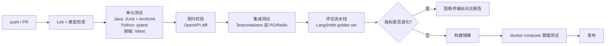

对应 AC-6.2：评估流水线是发布门禁的一部分，而不是事后统计。

---

## 5. 进程视图（Process View）

### 5.1 运行时进程与线程模型

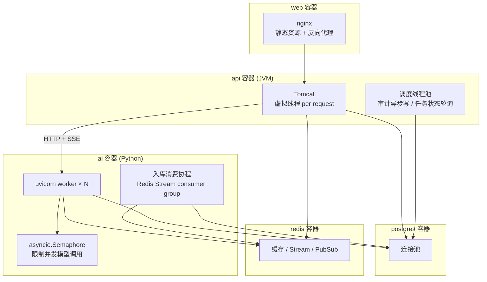

**Java 21 虚拟线程的用法**

- 启用 `spring.threads.virtual.enabled=true`，Tomcat 每请求一个虚拟线程。
- 咨询接口本质是长时间 IO 等待（等 `ai` 回流），虚拟线程让阻塞等待不占用平台线程，使 `api` 能以小线程池支撑高并发 SSE 连接。
- **不使用虚拟线程做 CPU 密集计算**，也**不在虚拟线程内使用 synchronized 包裹阻塞调用**（避免 pinning）。

**Python 侧并发模型**

- `ai` 服务全部 IO 为异步（HTTP 调用、数据库驱动均用异步实现）。
- LangGraph 的 fan-out 用 `asyncio.gather`，并由 `asyncio.Semaphore` 限制单 worker 并发模型调用数（建议 8）。
- 入库消费使用 Redis Stream 消费者组，允许多副本水平扩展，`XACK` 保证至少一次消费，配合幂等键避免重复入库。

### 5.2 关键并发路径：咨询的 fan-out / fan-in

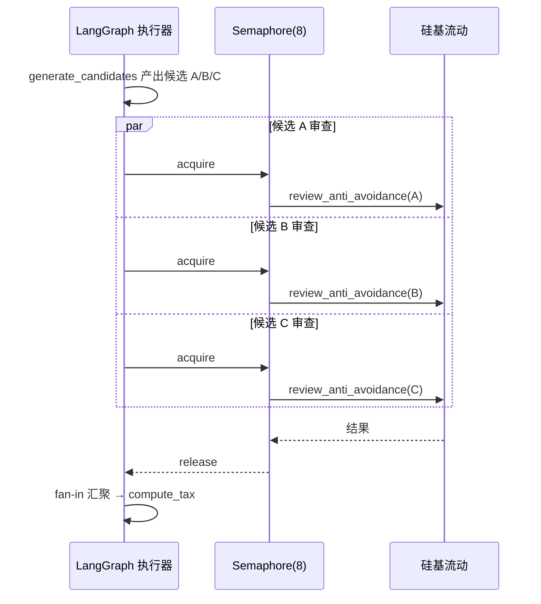

**为什么需要 Semaphore**：20 并发咨询 × 每轮 3~6 次模型调用 = 峰值 120 个在途请求。不加限制会触发上游限流并拖垮整体延迟。Semaphore 把并发压到上游可承受区间，代价是排队延迟——两者相比，稳定优先。

### 5.3 知识入库流水线的进程模型

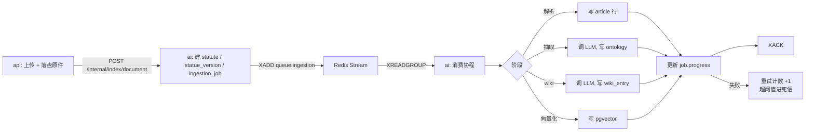

**幂等设计**：每个阶段以 `(job_id, stage)` 为幂等键，重复消费时先查状态表，已成功的阶段直接跳过。这保证"至少一次"消费语义下不会产生重复法条。

### 5.4 缓存与失效

| 缓存键 | 内容 | TTL | 失效方式 |
| --- | --- | --- | --- |
| `kb:version:{scope}` | 当前知识版本号 | 永久 | 发布时 DELETE + 广播 |
| `ontology:map:{jurisdiction}` | 本体静态映射 | 1h | 发布时按法域失效 |
| `wiki:entry:{entryId}` | 已审核词条 | 1h | 词条更新时失效 |
| `session:ctx:{sessionId}` | 会话上下文 | 30min | 会话结束时删除 |
| `ratelimit:{tenantId}:{window}` | 限流计数 | 窗口长度 | 自然过期 |

**关键原则：不缓存检索结果。** 检索结果的时效性直接关联 G1.2（≤5 秒生效），缓存检索结果会让"实时生效"变成"最多 1 小时后生效"。这是一个必须写进代码评审清单的约束。

**失效广播**

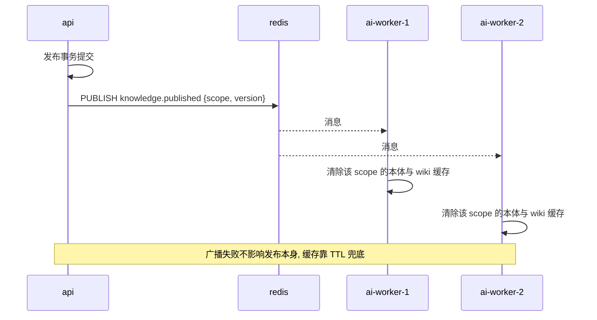

### 5.5 超时、重试与熔断

| 层级 | 策略 | 阈值 | 取值来源 |
| --- | --- | --- | --- |
| 单次模型调用 | 超时 | **120s** | `ai-service/app/core/config.py`（`llm_timeout_seconds`） |
| 单次模型调用 | 重试（指数退避 + 抖动） | **4 次** | 同上（`llm_max_retries`）。冷启动实测在 0.70s–65.85s 之间波动（决策记录 §3.2），重试不是可选项 |
| 单个图节点 | 超时 | 不单独设硬阈值 | 由全图预算统一约束，避免节点预算与全图预算互相打架 |
| 单次咨询全图 | **超时上限** | **180s** | 详细设计 §7.10 |
| 检索 | 超时 | 10s，失败即整单失败（检索是根基，不可降级） | 设计约定 |
| 熔断器 | 失败率阈值 / 冷却期 / 半开探测 | 50% / 60s / 单请求探测 | 设计约定 |
| `api` → `ai` | 读超时 / 连接池 | **180s** / 按并发配置 | `backend/src/main/resources/application.yml` |

> **不要把"超时上限"读成"服务目标"。** PRD 里"单次咨询 ≤90s"是 **SLO**（期望值，要按
> P95 衡量），上表的 180s 是**超时熔断线**（超过就放弃）。两者同时成立，不是一个数写错两次。
> 本表早期版本写的 30s / 3 次 / 100s 与代码里的实际配置都对不上，已改为以代码为准。

**降级优先级**：模型不可用 → 返回纯检索结果（S5）；**检索不可用 → 直接失败并明确报错**。理由：没有检索的"生成"就是幻觉制造机，宁可失败。

### 5.6 性能与容量

| 指标 | 目标 | 达成手段 |
| --- | --- | --- |
| 咨询首 token ≤3s | P95 | 意图识别与事实抽取用轻量提示；检索并行；流式输出不等全图完成 |
| 单次咨询 ≤90s | P95 | fan-out 并行；Semaphore 控制排队而非拥塞；上下文裁剪 |
| 发布生效 ≤5s | P95 | 索引按版本共存，发布即切换可见性，无重建 |
| 200 页 PDF ≤5min | P95 | 解析与抽取流水线化；抽取按 chunk 并行；批量写入 |
| 20 并发不降级 | — | 虚拟线程承载 SSE；Semaphore 限流；连接池预热 |

**容量估算（首批 6 法域）**

- 法条量：约 5,000 ~ 10,000 条 → 向量维度按 1024 计，约 40MB 级，pgvector 单机无压力。
- 发布批次：单次发布 1 部法规，约数百至数千法条，索引写入在事务内完成。
- 咨询峰值：假设 20 并发，平均每次 6 次模型调用，Semaphore=8/worker，部署 2 个 worker。

---

## 6. 物理视图（Physical View）

### 6.1 部署拓扑

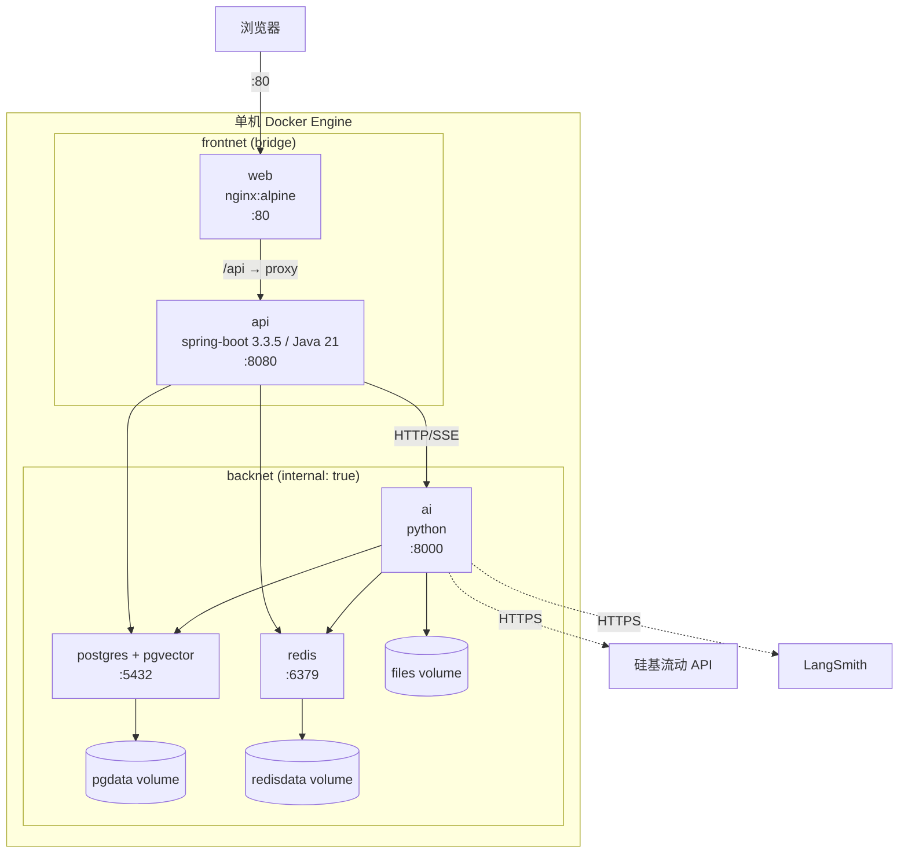

### 6.2 网络安全边界

| 边界 | 规则 |
| --- | --- |
| 浏览器 → web | 唯一对外暴露端口（80） |
| web → api | `frontnet` 内，**仅代理 `/api`**（`nginx.conf` 只定义了 `/api/` 与 `/healthz` 两个 location，不含 `/actuator`；运维探活走 compose 的 healthcheck，不经 nginx） |
| api → ai | `backnet` 内，`ai` **不发布宿主端口** |
| ai / api → postgres / redis | `backnet` 内，数据库与缓存**不发布宿主端口** |
| ai → 硅基流动 / LangSmith | 出网 HTTPS，密钥由环境变量注入 `ai` 容器 |
| 上传内容 | 视为不可信数据，落盘后经解析进入模型前做注入防护 |

> **`backnet` 声明为 `internal: true`** 是这套拓扑的关键：数据库、缓存、AI 服务都只在内部网络可达，宿主机上没有任何直接访问入口。这直接支撑 AC-5.1 的攻击面收敛。

### 6.3 容器清单与健康检查

| 服务 | 镜像来源 | 端口 | 健康检查 | 启动依赖 |
| --- | --- | --- | --- | --- |
| `web` | nginx:alpine + 构建产物 | 80 | `GET /healthz` | `api` healthy |
| `api` | eclipse-temurin:21 + jar | 8080 | `/actuator/health/readiness`（**用 readiness 而非 liveness**：liveness 只反映进程活着，会让上游在依赖未就绪时开始调用） | `postgres`、`redis` healthy |
| `ai` | python:3.11-slim + 依赖 | 8000（内网） | `GET /healthz` 与 `/readyz` 两档 | `postgres`、`redis`、`api` healthy |
| `postgres` | pgvector/pgvector:pg16 | 5432（内网） | `pg_isready` | — |
| `redis` | redis:7-alpine | 6379（内网） | `redis-cli ping` | — |

### 6.4 数据持久化

| 卷 | 挂载点 | 内容 | 备份策略 |
| --- | --- | --- | --- |
| `pgdata` | `/var/lib/postgresql/data` | 全部业务数据、本体、向量、检查点 | `pg_dump` 定时导出 |
| `redisdata` | `/data` | 缓存与 Stream（可重建） | 不备份（AOF 可选） |
| `files` | `/data/files` | 上传原件、解析中间产物、导出报告 | 与 pgdata 同步备份 |

**启动初始化顺序**：`postgres` 健康 → Flyway 迁移 + 种子数据（`api` 启动时执行）→ `api` 健康 → `ai` 启动（建 LangGraph 检查点表）→ `web` 可用。对应 AC-6.3 的"一条命令 5 分钟内可用"。

### 6.5 环境配置矩阵

| 变量 | 归属容器 | 说明 | 是否入仓 |
| --- | --- | --- | --- |
| `SILICONFLOW_API_KEY` | `ai` | 硅基流动密钥 | **否**，仅 `.env.example` 占位 |
| `SILICONFLOW_BASE_URL` | `ai` | OpenAI 兼容端点 | 是（非敏感默认值） |
| `CHAT_MODEL` | `ai` | **`deepseek-ai/DeepSeek-V4-Flash`**（**必须写完整模型 ID**：用产品名 `deepseek-v4-flash` 直接请求会 404，这是实测踩过的坑，见决策记录 D-01） | 是 |
| `EMBEDDING_MODEL` | `ai` | `Qwen/Qwen3-Embedding-8B`（`dimensions=1024`）。原为开放问题 OQ-03，**已由实测确证**，见决策记录 D-03 | 是 |
| `LANGSMITH_API_KEY` | `ai` | LangSmith 密钥 | **否** |
| `LANGSMITH_PROJECT` | `ai` | 项目名 | 是 |
| `POSTGRES_*` | `api` / `ai` / `postgres` | 库名、用户、口令 | 口令**否** |
| `REDIS_*` | `api` / `ai` | 连接信息 | 口令**否** |
| `JWT_SECRET` | `api` | 签名密钥 | **否** |
| `INTERNAL_TOKEN_SECRET` | `api` / `ai` | 内部调用令牌密钥 | **否** |

对应 AC-7.3：仓库仅提交 `deploy/.env.example`，`.gitignore` 覆盖 `.env`。

### 6.6 演示环境形态

面试演示直接使用本机 Docker Compose（6.1 拓扑）。若需公网演示，仅将 `web` 的 80 端口通过反向代理暴露，其余保持不变——**不需要改变任何应用配置**，这是该拓扑的一个附带好处。

---

## 7. 视图一致性与追溯

### 7.1 场景 → 逻辑视图

| 场景 | 领域对象 | 领域服务 |
| --- | --- | --- |
| S1 上传到生效 | `Statute` `StatuteVersion` `Article` `OntologyEntity` `WikiEntry` | `KnowledgePublishService` |
| S2 税务筹划 | `ConsultRun` `AnswerCitation` `TaxCalculation` `RiskFinding` | `CitationVerifier` `EffectiveVersionResolver` |
| S3 差异分析 + 拒答 | `ConsultRun` `RedlineHit` `RedlineRule` `OntologyEntity` | `RedlineRuleEngine` |
| S4 越权拦截 | `Tenant` `User` `AuditLog` | `TenantContextHolder` |
| S5 降级 | `ConsultRun`（status=DEGRADED） | — |

### 7.2 场景 → 开发视图

> **本表描述目标结构，不是现状。** 带 `*` 的模块**尚未实现**。截至 2026-09-30，仓库里实际存在的
> 前端模块：`views/{LoginView,KnowledgeView,ReviewView,ConsultView,AuditView}.vue`（**五个页面均已实现**，
> 四个业务页面已通过 `npm run build`）、`components/{StateBlock,StatusBadge,RedlineNotice,CitationList,ConsultAnswer,InterruptForm,UploadPanel,PlaceholderPanel}.vue`、
> `api/{client,auth,knowledge,consult,audit,sse}.ts`、`stores/auth.ts`、`layouts/AppLayout.vue`。
> 即 7.2 表里前端一列的多数模块**已经落地**；表中 `*` 标记的是服务端与 AI 侧模块。
> 本表早期版本引用了 `views/Upload`、`views/Consult`、`composables/useSSE`、`composables/useAuth`、
> `components/RedlineNotice`、`components/DegradedNotice` 这些**在仓库里并不存在**的路径，
> 且没有标注它们是规划项——这会让评审误以为前端已经成型。现已按实际文件名对齐。

| 场景 | 后端模块 | AI 模块 | 前端模块 |
| --- | --- | --- | --- |
| S1 | `application/KnowledgeAppService`\*、`infrastructure/persistence` | `graph/ingest_graph`\*、`indexing`\*、`ontology`\*、`wiki`\* | `views/KnowledgeView.vue`、`views/ReviewView.vue`、`components/UploadPanel.vue`（均已实现） |
| S2 | `application/ConsultAppService`\*、SSE 端点\* | `graph/consult_tax_graph`\*、`retrieval`\*、`chains`（已就绪） | `views/ConsultView.vue`、`api/sse.ts`、`components/ConsultAnswer.vue`（均已实现） |
| S3 | `application/ConsultAppService`\* | `graph/consult_gap_graph`\*、`redline`\* | `views/ConsultView.vue`、`components/RedlineNotice.vue`（均已实现） |
| S4 | `infrastructure/security`（已就绪） | 接收内部令牌中的租户上下文（待实现） | `stores/auth.ts`（已就绪）、`api/client.ts`（已就绪） |
| S5 | SSE 降级分支\* | `observability` 熔断装配（部分就绪） | `components/DegradedNotice.vue`\* |

### 7.3 场景 → 进程视图 → 物理视图

| 场景 | 进程特征 | 物理落点 |
| --- | --- | --- |
| S1 | 异步流水线 + Redis Stream 消费 + 发布广播 | `ai` 消费协程、`postgres`、`redis`、`files` 卷 |
| S2 | 虚拟线程承载长 SSE + 图内 fan-out | `api` 虚拟线程、`ai` uvicorn worker、`backnet` |
| S3 | 同 S2，额外写审计 | 同上 + `postgres` 审计表 |
| S4 | 请求拦截链（同步短事务） | `api` 拦截器、`backnet` 内网隔离 |
| S5 | 熔断状态机 + 降级分支 | `ai` 熔断器、出网 HTTPS |

### 7.4 验收标准 → 视图元素

| 验收标准 | 依赖的视图元素 | 风险点 |
| --- | --- | --- |
| AC-1.3 发布 ≤5s 生效 | 索引按版本共存（逻辑 3.4）+ 不缓存检索结果（进程 5.4）+ 广播失效 | 若引入检索结果缓存，该指标立即失效 |
| AC-1.4 按版本回答 | `EffectiveVersionResolver`（逻辑 3.5） | 检索层若绕过该服务直接过滤，会答错版本 |
| AC-2.3 计算可复算 | `compute_tax` 为确定性节点（场景 S2）+ `TaxCalculation.calcTrace` | 若允许模型参与计算，可复算性丧失 |
| AC-2.5 引用可溯 | `verify_citations` 必经节点（场景 S2） | 若将其改为可选，幻觉引用直接外泄 |
| AC-4.1 红线召回 100% | `redline` 独立于 `chains`（开发 DR-4） | 若红线判定依赖模型，会被提示词绕过 |
| C-1 ~ C-4 合规边界约束（PRD §3.6.4） | C-1 → `redline` 不 import `chains`（开发 DR-4）；C-2 → 拒答五要素 + 审计（场景 S3 + 逻辑 3.5）；C-3 → 召回率与误拒率**成对**成立（AC-4.1 + AC-4.3）；C-4 → 上传内容按不可信输入处理（物理 6.2 + 详细设计 §11.2） | 四条约束里任何一条退回成"文档约定"，都会在赶工的一次提交里被绕过——C-1 尤其如此 |
| AC-5.1 跨租户 0 成功 | 租户上下文仅来自 JWT（场景 S4）+ 检索层强制注入过滤（进程 5.4）+ `backnet` 隔离（物理 6.2） | 任一层放松即失守 |
| AC-6.3 一键启动 | 健康检查与启动顺序（物理 6.3/6.4） | 依赖顺序缺失会导致迁移未完成即启动服务 |
| AC-1.1 上传与解析 | 场景 S1 + `kb.ingestion_job.stage`（详细设计 3.9.4）+ 条款切分算法（详细设计 4.3） | 切分正则按法域维护，新法域需补模式 |
| AC-1.2 本体抽取 | 场景 S1 + `kb.ontology_entity/relation`（详细设计 3.9.7）+ 抽取 schema（详细设计 4.4） | 低置信度必须落 `DRAFT`，否则未审内容可被检索 |
| AC-1.6 语料规模与溯源 | `kb.statute_version.source_url/source_fetched_at`（详细设计 3.9.2）+ 采集校验脚本 | 溯源字段落在版本层；脚本按"每条法条可解析出非空 URL"断言 |
| AC-1.7 扫描件不静默丢失 | `kb.ingestion_job.stage='NEEDS_MANUAL'`（详细设计 3.9.4 / 4.2） | 若把扫描件当空文本继续走流程，会产出空条款污染知识库 |
| AC-3.1 差异矩阵不缺项 | 矩阵生成器仅在检索命中时填值（场景 S3） | 模型推断格值即失守，须由 `verify_citations` 兜底 |
| AC-4.3 误拒率 ≤10% | 红线规则集合与合法样本集（详细设计 8） | 只优化召回率会把系统推向"一律拒答"的退化解 |
| AC-7.2 使用手册含真实截图 | 场景 S1–S3 的可操作路径 + `artifacts/screenshots/` | 截图须来自真实运行，不得手工拼装 |
| AC-7.3 密钥不入库 | 仅提交 `deploy/.env.example`（物理 6.5） | `.env` 由 `.gitignore` 覆盖 + CI 最前置密钥扫描 |
| AC-7.4 公开仓库可离线复现 | `MODEL_MODE=replay` 回放 fixture（逻辑 3.6）+ 启动顺序（物理 6.3） | 若 demo 依赖真实密钥，面试官无法复现 |
| AC-7.5 文档与实现一致 | 本矩阵 + 附录 A/B | 文档与实现各说各话时以本矩阵为核对清单 |

### 7.5 设计决策摘要（供评审快速过）

| 编号 | 决策 | 备选 | 取舍理由 |
| --- | --- | --- | --- |
| AD-1 | 双服务（Spring Boot + Python），非单栈 | 纯 JVM（LangChain4j） | 需求指定的四个 AI 组件均为 Python 库；引入 JVM 方案属技术栈变更 |
| AD-2 | 向量检索用 pgvector | Redis 向量检索 / 独立向量库 | PostgreSQL 已在栈内，不新增存储组件；当前数据量级单机足够 |
| AD-3 | 检查点存 PostgreSQL | Redis | 咨询可能跨小时级中断（用户离开后回来补充信息），需要持久；Redis 只做短期工作态 |
| AD-4 | 业务数据由 `api` 独占写入，`ai` 只读知识表 + 独占自身 schema | `ai` 直接写业务表 | 审计链路的权威性集中在业务层；避免两服务对同一表竞争写 |
| AD-5 | 数字计算不进模型 | 让模型算 | 可复算、可审计；税务数字错误代价过高 |
| AD-6 | 红线判定独立于模型链路 | 由模型判定 | 防止提示词绕过安全边界；DR-4 固化为结构约束 |
| AD-7 | 不缓存检索结果 | 缓存检索结果 | 与 G1.2（≤5s 生效）直接冲突 |
| AD-8 | 检索失败即整单失败，模型失败降级为纯检索 | 均降级 | 无检索的生成等于幻觉制造 |

---

## 附录 A：与 PRD 的差异说明

本文件在 PRD 基础上补充/细化的内容：

1. 补充了 PRD 未展开的**运行时并发模型**（第 5 章），特别是 fan-out 的 Semaphore 限流与降级优先级。
2. 补充了**网络安全边界**（6.2）与**启动依赖顺序**（6.4），直接支撑 AC-6.3。
3. 明确了 **AD-4 数据写入职责边界**：业务数据由 `api` 独占写入。PRD 未涉及此点，但它影响后续详细设计的仓储划分。
4. 明确了 **A-7（FastAPI）** 作为 A-1 双运行时下的实现细节。
5. 本文件的**接口路径以《详细设计说明书》§2.2 REST 接口清单为准**。场景视图中早期使用的 `/api/admin/*`、`/api/consult/*` 写法已统一为契约中的 `/api/knowledge/*`、`/api/consult-sessions/*`。
   前端代理配置也已同步：`frontend/nginx.conf` 与 `vite.config.ts` 的 SSE 规则改为正则，覆盖三条流式端点（咨询结果 / 追问恢复 / 入库进度），不再只匹配某一条。
6. 场景 S1 中"谁创建 `kb` 行"曾被写成由 `api` 执行，与 AD-4 及详细设计 §3.1 的 schema 写入边界冲突。现已修正为：`api` 只落盘原件并调用 `ai` 的内部端点，由 `ai` 创建 `statute / statute_version / ingestion_job`。
7. 补充了 **P2 知识库表的字段级 DDL**（详细设计 §3.9），含 `kb` schema 的 RLS 策略与角色拆分前置动作。

## 附录 B：待详细设计承接的事项

| 项 | 承接章节 |
| --- | --- |
| `app` schema 表字段级 DDL 与索引设计（P1） | 详细设计 3.4 |
| `kb` schema 表字段级 DDL、RLS、角色拆分与索引（P2） | 详细设计 3.9 |
| 变更检测（US-A6）的比对口径 | 详细设计 3.10 |
| 本体抽取算法（切分、抽取、置信度、冲突检测） | 详细设计 第 4 章 |
| LLM wiki 生成与引用绑定 | 详细设计 第 5 章 |
| 引用校验算法与降级策略 | 详细设计 第 6 章 |
| 路由式混合检索与重排算法 | 详细设计 第 6 章 |
| LangGraph 各节点提示词模板与输出 schema | 详细设计 第 7 章 |
| 红线规则的可配置 DSL 与匹配算法 | 详细设计 第 8 章 |
| 评测集构造与评估指标定义 | 详细设计 第 9 章 |
